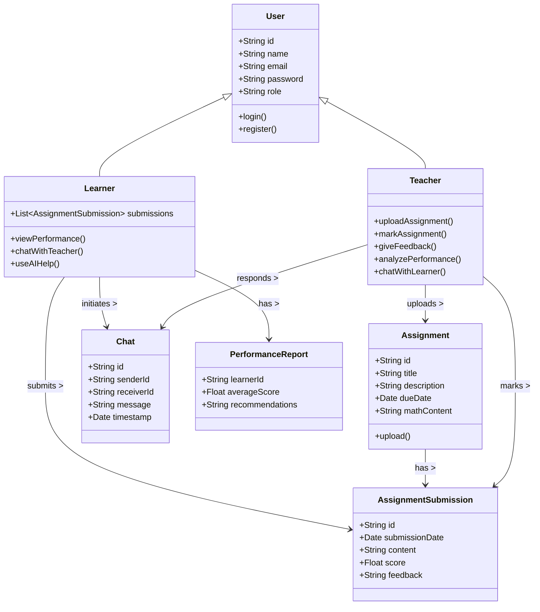

#  Math Booster – Domain Model Documentation

##  Introduction

**Math Booster** is a web-based and mobile application designed to help learners in primary and high school improve their mathematics performance. The system addresses the pressing issue of poor mathematics results and high dropout rates from Grade 10 to 12. It integrates secure access, interactive tools, AI-powered features, and real-time teacher-learner collaboration to support effective learning.

---

##  Stakeholders & Concerns

| Stakeholder | Concern |
|-------------|---------|
| **Learners** | Improved understanding of Math, interactive learning, feedback on performance |
| **Teachers (Admins)** | Upload and mark assignments, analyze performance, communicate securely with learners |
| **Parents (Indirect)** | Ensuring a secure, performance-driven environment |
| **School Administrators** | Ensuring student success, data privacy, and teaching efficacy |
| **Developers** | Scalability, AI integration, secure APIs, real-time communication |
| **Regulatory Bodies** | POPIA compliance and secure data handling |

---

## ✅ Functional Requirements

1. **Secure Authentication**
   - User registration and login using third-party API
2. **User Roles**
   - Teachers (Admins) and Learners
3. **Assignment Workflow**
   - Teachers upload assignments; learners submit answers; teachers mark and give feedback
4. **Real-Time Chat**
   - Secure, in-app chat between teachers and learners (no third-party apps like WhatsApp)
5. **Performance Analytics**
   - Visual insights and tracking of learners’ progress
6. **AI-Powered Help**
   - Learners can search for help or solutions using AI
7. **Math Symbol Editor**
   - Support for rendering math symbols during assignments or discussions
8. **Code/Math Editor**
   - Simple VS Code-like editor interface for math/code-based interaction
9. **Leaderboard**
   - Display of top-performing learners on the dashboard

---

## ❌ Non-Functional Requirements

- **Security**: Use secure protocols and comply with POPIA for user data.
- **Scalability**: Scalable to support thousands of users concurrently.
- **Performance**: Fast response time (<1 second for major actions).
- **Availability**: Minimum 99.9% uptime.
- **Maintainability**: Modular architecture with clear separation of concerns.
- **Cross-Platform**: Available via browser and mobile (responsive or native).
- **Usability**: Intuitive interfaces suitable for both teachers and young learners.

---

##  Domain Class Diagram (Mermaid.js)

---

##  Key Domain Entities

### User
- Common attributes for both Learners and Teachers.
- Abstract superclass.

### Learner
- Subclass of User.
- Can submit work, chat, use AI tools, and view reports.

### Teacher
- Subclass of User.
- Has admin privileges: uploading, marking, analyzing.

### Assignment
- Uploaded by Teacher.
- Includes title, description, math content, and due date.

### AssignmentSubmission
- Contains learner's response, marks, and feedback.

### Chat
- Secure messages exchanged between teachers and learners.

### PerformanceReport
- Analytics generated from learner submissions with recommendations.

---

##  Conclusion

This domain model provides a solid foundation for building the **Math Booster** system, addressing real-world challenges in mathematics education through a secure, AI-powered, collaborative platform. This documentation should serve as a reference for developers, designers, and stakeholders to maintain alignment throughout the development lifecycle.

---
